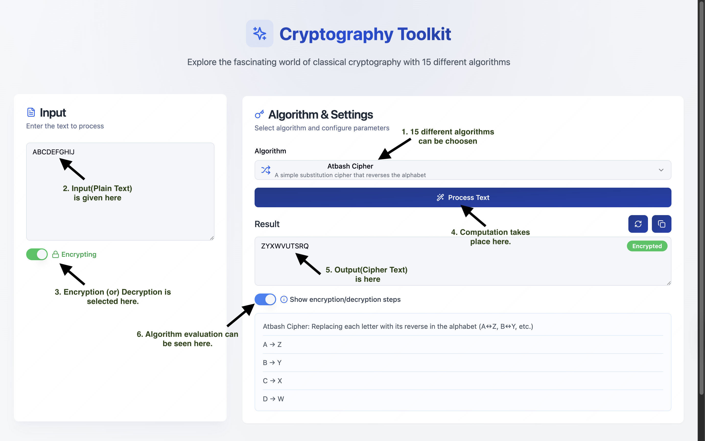

# CipherGrid - Classical Cryptography Toolkit 🔐

A modern, interactive web application showcasing 15 classical cryptographic algorithms with real-time encryption and decryption capabilities.

## 🌟 Features

- **15 Classical Ciphers** implemented with detailed step-by-step explanations
- **Real-time Encryption/Decryption** with visual feedback
- **Interactive UI** with smooth animations and transitions
- **Comprehensive Documentation** for each algorithm
- **Mobile Responsive Design**

### Supported Algorithms

#### Single Substitution (Monoalphabetic)
- Atbash Cipher
- Caesar Cipher
- Affine Cipher

#### Multiple Substitution
##### Polyalphabetic
- Vigenère Cipher
- Gronsfeld Cipher
- Beaufort Cipher
- Auto Key Cipher
- Running Key Cipher

##### Polygraphic
- Hill Cipher

#### Transposition Ciphers
- Rail Fence Cipher
- Route Cipher
- Columnar Cipher
- Double Transposition Cipher
- Myszkowski Cipher
- Grilles Cipher

## 🚀 Live Demo

Visit the live application: [CipherGrid](https://ciphergrid.vercel.app/)

## 💻 Tech Stack

- React 18
- TypeScript
- Tailwind CSS
- Vite
- Radix UI Components
- Lucide Icons

## 🛠️ Installation

1. Clone the repository:
   ```bash
   git clone https://github.com/rishithr1/CryptoGraphy-13-Algorithms.git
   ```

2. Install dependencies:
   ```bash
   cd CryptoGraphy-13-Algorithms
   npm install
   ```

3. Start the development server:
   ```bash
   npm run dev
   ```

4. Build for production:
   ```bash
   npm run build
   ```

## 📸 Screenshots





## 📁 Project Structure

```
CryptoGraphy-13-Algorithms/
├── src/
│   ├── components/
│   │   └── ui/           # UI components
│   ├── lib/
│   │   ├── ciphers.ts    # Cipher implementations
│   │   └── utils.ts      # Utility functions
│   ├── App.tsx          # Main application component
│   └── main.tsx         # Application entry point
├── public/              # Static assets
└── assets/             # README assets (screenshots, etc.)
```

## 📷  Screenshots
   - `demo.gif` - Working of my cryptotollkit
   https://drive.google.com/file/d/18UXBZer3lUPE1v45i90yKEveerii9UaC/view?usp=sharing
     
   - `homepage.png` - Homepage screenshot


   - `encryption.png` - Encryption process screenshot


## 🤝 Contributing

1. Fork the repository
2. Create a new branch: `git checkout -b feature/amazing-feature`
3. Commit your changes: `git commit -m 'Add amazing feature'`
4. Push to the branch: `git push origin feature/amazing-feature`
5. Open a Pull Request

## 👨‍💻 Author

V S Rishith Reddy
- GitHub: [@rishithr1](https://github.com/rishithr1)

## Acknowledgments

- [Lucide Icons](https://lucide.dev) for the beautiful icons
- [Radix UI](https://www.radix-ui.com) for accessible UI components
- [Tailwind CSS](https://tailwindcss.com) for the utility-first CSS framework
